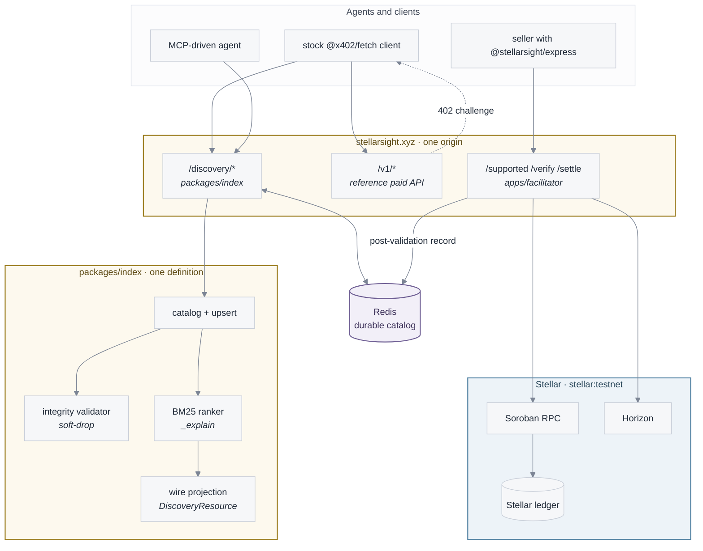
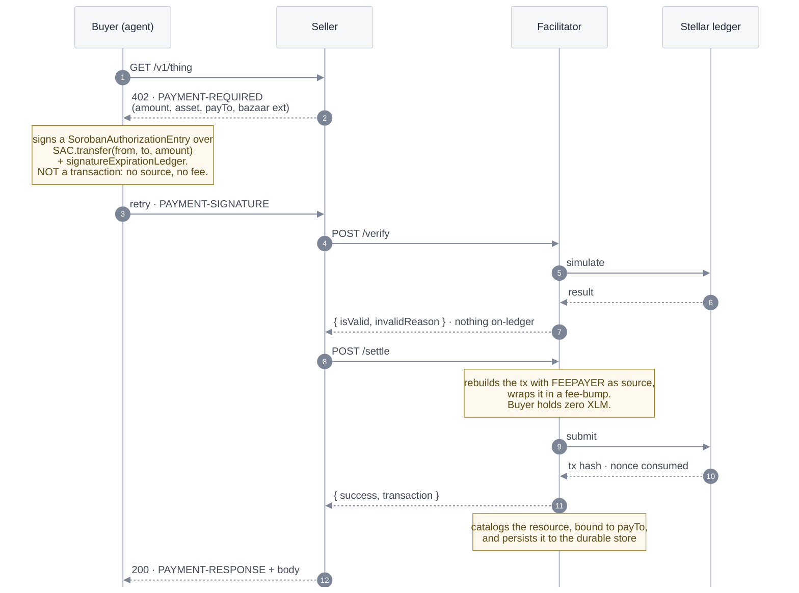
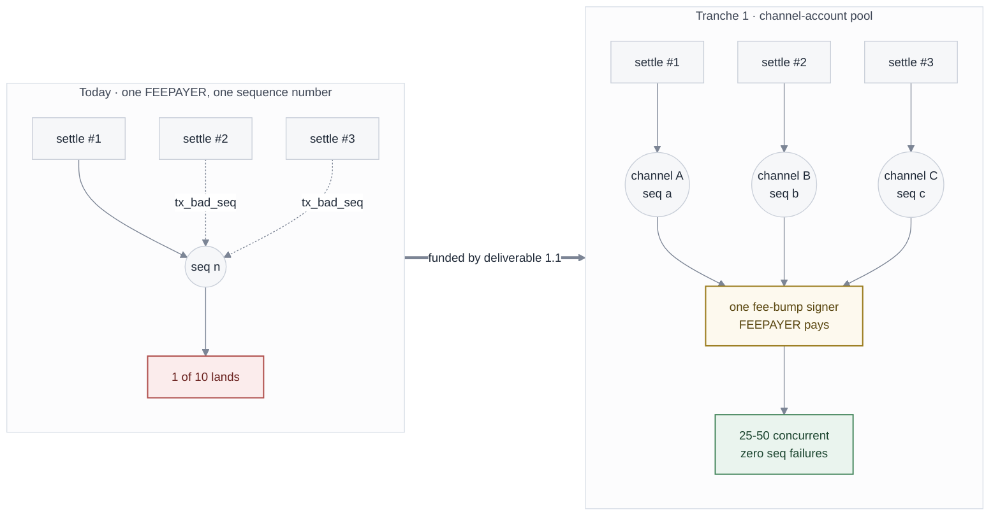
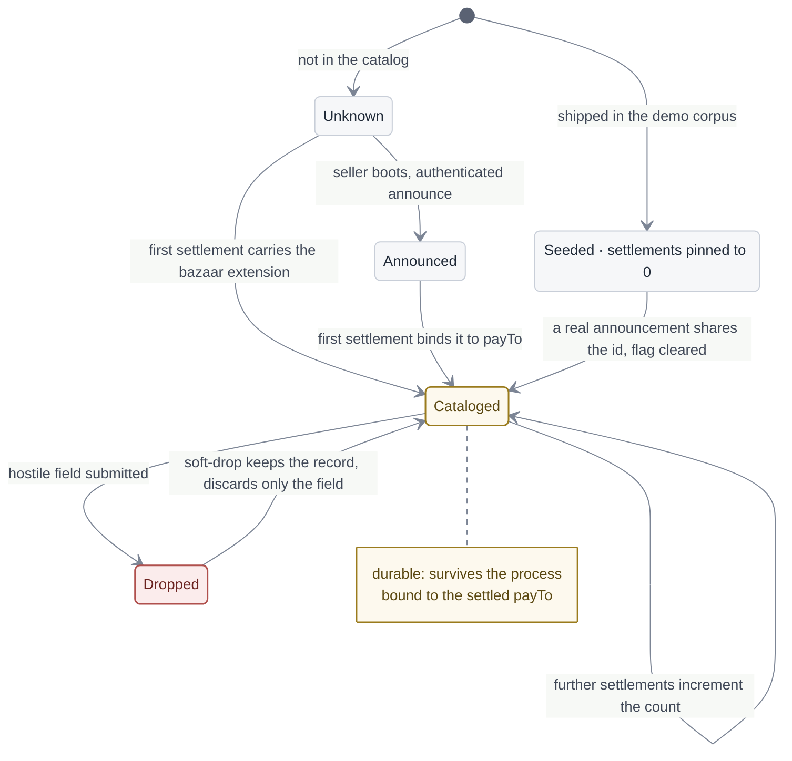
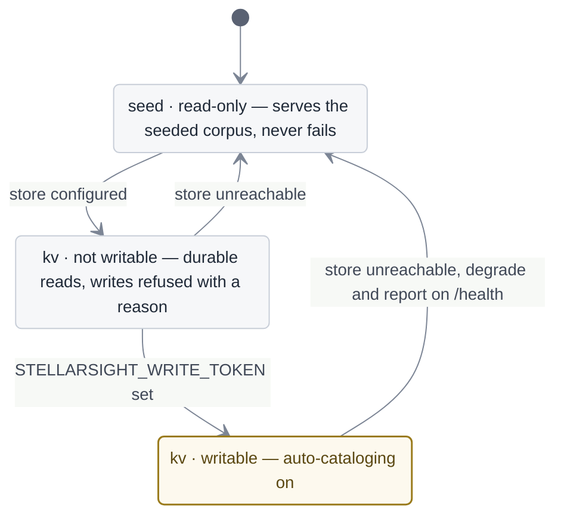
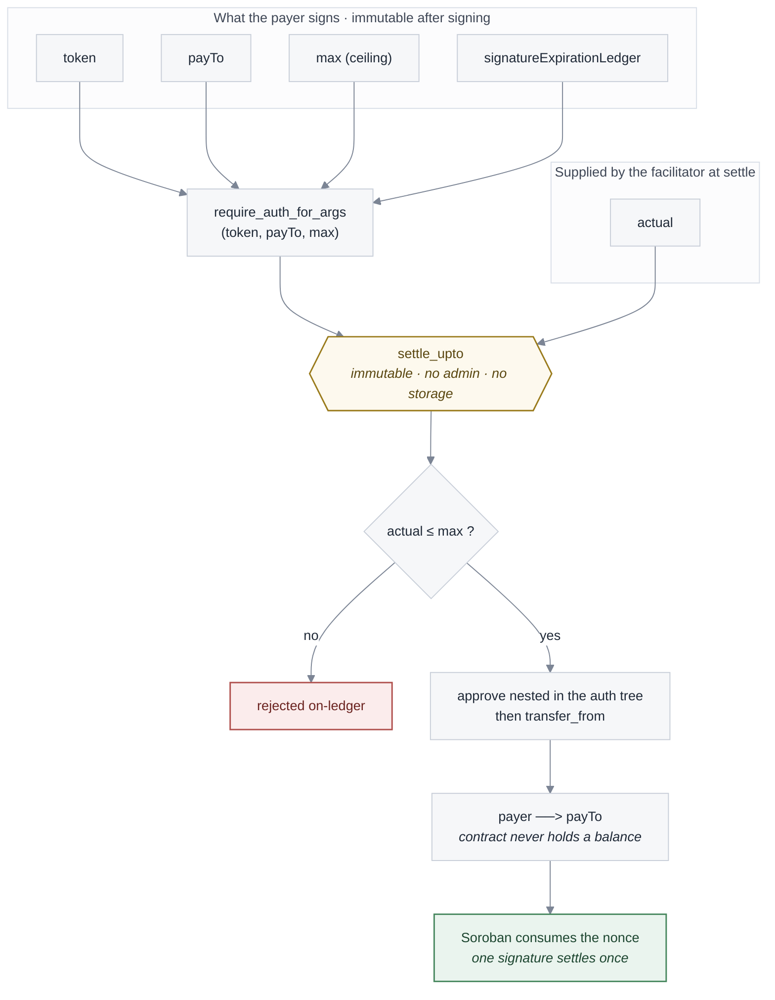

**Stellar Community Fund #45 · RFP track · "x402 Facilitator with Bazaar (discovery) support"**

This document is the engineering companion to the SCF submission. It describes what runs
today on `stellar:testnet`, exactly how it uses Stellar, and what the award funds on top of
it. Everything below is in the public repository
[github.com/pedro-pelicioni/stellarsight](https://github.com/pedro-pelicioni/stellarsight)
(Apache-2.0), and the hosted deployment is [stellarsight.xyz](https://stellarsight.xyz).

Claims here are written to be checked, not believed. Where a section states a number, the
command that produces it is named. Where something is not built, it says so in the same
sentence rather than in a footnote.

---

## Table of contents

1. [System overview](#1-system-overview)
2. [The payment path, in Stellar terms](#2-the-payment-path-in-stellar-terms)
3. [The Bazaar: the facilitator-side catalog](#3-the-bazaar-the-facilitator-side-catalog)
4. [Search](#4-search)
5. [The agent and seller surfaces](#5-the-agent-and-seller-surfaces)
6. [The `upto` scheme (planned, Tranche 2)](#6-the-upto-scheme-planned-tranche-2)
7. [Security and trust model](#7-security-and-trust-model)
8. [Monitoring and operations](#8-monitoring-and-operations)
9. [Deployment topology](#9-deployment-topology)
10. [Architecture mapped to the funded tranches](#10-architecture-mapped-to-the-funded-tranches)
11. [Operating as a public good](#11-operating-as-a-public-good)
- [Appendix A — Verify this yourself](#appendix-a--verify-this-yourself)
- [Appendix B — Repository map](#appendix-b--repository-map)

---

## 1. System overview

### 1.1 The gap this fills, stated precisely

Stellar can already settle an x402 payment. The `@x402/stellar` package implements the
`exact` scheme, and this project composes it rather than reimplementing it. What Stellar
does **not** have is the other half of the protocol:

| Piece | Status |
|---|---|
| The `bazaar` extension spec defines `GET /discovery/resources` and `GET /discovery/search` | Exists, in the x402 spec |
| `@x402/extensions/bazaar` implements them | **No.** Its own README states it ships client and server helpers and no facilitator-side catalog implementation |
| Stellar has a Bazaar | **No.** [`stellar/x402-stellar#50`](https://github.com/stellar/x402-stellar/issues/50), "Explore Bazaar support for Stellar", open and unassigned since April 2026 |

An agent that can pay but cannot discover is an agent with a wallet and no map. The RFP
names discovery as the highest-value part of the scope and says settlement is largely
solved. This architecture takes that literally: the catalog is the product, and the
payment loop exists around it so the catalog can be populated by something real.

### 1.2 The invariants

Three properties hold everywhere in this design, and every later section is downstream of
them.

**The facilitator is non-custodial.** It holds no user funds, has no deposit or withdrawal
path, and cannot move money. Every settlement is a direct SEP-41 transfer from the buyer's
account to the seller's, authorized by the buyer's own signature over the full invocation.
A fully compromised facilitator can refuse service and can waste its own sponsored fees. It
cannot redirect a payment, change an amount, or move funds it was not authorized to move.

**The catalog is a trust boundary.** Discovery metadata is attacker-controlled: clients
echo the `resource` block back inside the payment payload, and everything the catalog
returns will be read by an LLM-driven agent that then sends money. Validation is therefore
mechanical and adversarial, and 70 of the repository's tests exist only to attack it.

**Listings are born from settled Stellar payments.** A resource enters the catalog when a
settlement carrying the discovery extension succeeds, and the entry is bound to that
payment's recipient. This is the anti-spam mechanism and it is Stellar-specific: account
and trustline reserves put a real cost on manufacturing fake listings, which an off-chain
registry cannot charge.

### 1.3 What runs today, and what the award funds

| Component | Today | Award adds |
|---|---|---|
| Facilitator (`/supported`, `/verify`, `/settle`) | Live, testnet, `exact` scheme, fees sponsored | Channel-account pool, `upto`, mainnet with USDC |
| Bazaar catalog | Live and durable at stellarsight.xyz | Per-seller identity, ownership re-verification |
| Search | Live, BM25 hybrid, nDCG@10 **0.864** measured | Golden set to 150–200 queries, CPU-only semantic layer |
| Agent surface | MCP over stdio, 4 tools | Hosted HTTP MCP, TS/Go/Python adapter tests |
| Threat model + monitoring plan | Published, v0.1 | Implemented, alerts firing |
| `upto` scheme | Published position, no contract | Spec upstream, contract on testnet |
| Network | `stellar:testnet` only | `stellar:pubnet`, 30 days measured uptime |

### 1.4 System architecture



The trust boundary is the edge of `core`: everything crossing into it from a seller or a
buyer is attacker-controlled and goes through the validator before it can reach the catalog
or the ledger.

### 1.5 The stack in one paragraph

Node ≥22, pure ESM, no build step outside the web console. One Express app is the
facilitator; one npm workspace (`packages/index`) is the catalog, its ranker and its
integrity validator; the same modules are mounted three ways — locally on `:4022`, as
Vercel Functions under `/discovery/*`, and inside the facilitator process — so there is one
definition of the wire format and no surface can drift from it. State that must outlive a
process lives in a Redis-compatible store. Nothing else is stateful. All Stellar
cryptography is delegated to `@x402/stellar`; this project never signs or verifies by hand.

---

## 2. The payment path, in Stellar terms

### 2.1 Protocol surface

x402 **v2** throughout. The 402 challenge travels in the `PAYMENT-REQUIRED` response
header, the signed payload arrives in `PAYMENT-SIGNATURE`, the receipt returns in
`PAYMENT-RESPONSE`, and cataloging outcomes are reported in `EXTENSION-RESPONSES`. The v1
spellings (`X-PAYMENT`, the challenge in the JSON body) are still accepted and emitted for
compatibility, and nothing depends on them.

Networks are CAIP-2 identifiers: `stellar:testnet` today, `stellar:pubnet` at Tranche 3.
`GET /supported` advertises:

```json
{ "kinds": [ { "x402Version": 2, "scheme": "exact", "network": "stellar:testnet",
               "extra": { "areFeesSponsored": true, "asset": "CAYCPWN5…GPO2" } } ] }
```

### 2.2 The buyer signs an authorization entry, not a transaction

This is the Stellar-specific heart of the flow and the reason the fee model works.

A Soroban authorization entry (CAP-0046-11) binds the payer's signature to the entire
invocation tree: the contract being called, the function, and every argument. It does
**not** bind the transaction envelope, the source account, or the fee. So the buyer can
authorize *exactly this payment* while a different account submits it and pays for it.



### 2.3 SEP-41 / SAC

The payment itself is a SEP-41 `transfer` on a Stellar Asset Contract. Any SEP-41 asset is
accepted; the scheme is asset-agnostic by construction.

On testnet the deployment issues **its own** classic asset (`SXT`) and wraps it with
`createStellarAssetContract`, so `npm run setup` runs start to finish with no Circle faucet
captcha and no API key. That is a deliberate developer-experience decision, not a shortcut:
the `exact` scheme accepts any SEP-41 token and USDC is only the default. **Mainnet launches
on the Circle USDC SAC** (Tranche 3, deliverable 3.1), with additional assets enabled by
configuration.

**A trustline comes first, and that is an onboarding problem, not a payment one.** A Stellar
account cannot receive a SEP-41 asset until it holds a trustline to it, so both sides of a
first payment need one before anything can settle. This deployment absorbs that for the
paths it controls — `npm run setup` issues `SXT`, deploys its SAC and adds the trustlines in
one idempotent command, and the public faucet funds a browser visitor's throwaway account
the same way — which is why the quickstart reaches a settled payment without a separate
onboarding step. It is worth being explicit that this is a *local* answer to a general
problem: the RFP points at **AHA Labs' Trustline Onboarder RFP** as the ecosystem-level
solution, and when that lands the right move is to route buyers to it rather than to keep
growing a faucet. Nothing in the payment path assumes our version, and none of the
onboarding here is load-bearing for the payment path itself.

Amounts are integer strings in atomic units, 7 decimals. In x402 **v2** the price field on
`PaymentRequirements` is `amount`; the v1 name `maxAmountRequired` fails
`PaymentRequirementsSchema` in the installed `@x402/core`, so an `accepts` entry built with
it is silently unusable. Both are read on input; only `amount` is emitted.

### 2.4 Fee sponsorship and the 500,000-stroop ceiling

The facilitator's `FEEPAYER` account is both the transaction source and the fee-bump
signer, so **the paying agent needs zero XLM** — it holds only the asset it is paying with.

`maxTransactionFeeStroops` is a safety ceiling, not a fee that gets paid: `@x402/stellar`
simulates the transfer and refuses at `/verify`, before any money moves, if the
simulation-derived fee exceeds it. The library default is 50,000.

That default is too tight for this scheme and was breaking payments intermittently. A
SEP-41 SAC transfer with a sponsored fee bump simulates around **57,000 stroops** on testnet
today, above the default, and the margin moves with network load — so the failure appears
under load and disappears when you go looking for it. Observed during development: four
consecutive `/verify` rejections at 57,031–57,038 stroops, then a settlement that squeaked
through at max_fee 57,227 an hour later.

The ceiling is therefore set to **500,000 stroops (0.05 XLM)**: 8.7× the observed
simulation, still small enough to catch a genuinely runaway transaction, which is what a
ceiling is for. The derivation is in the source next to the constant
(`apps/facilitator/src/server.mjs`), so a reviewer can audit the reasoning and not just the
number.

### 2.5 Replay and expiry are enforced on-chain

There is deliberately **no facilitator-side replay cache**. Soroban consumes the
authorization nonce when the call executes, and `signatureExpirationLedger` bounds the
window. A cache would be a second source of truth that can be poisoned, out-of-sync, or
bypassed by a second facilitator instance; the ledger cannot. Client-side, a replayed or
expired authorization is mapped to a distinct machine-readable code
(`STELLARSIGHT_REPLAY_REJECTED`, `STELLARSIGHT_AUTH_EXPIRED`) so the caller can tell the two
apart.

### 2.6 One fee-payer is the current bottleneck, and it is measured

A Stellar account has one sequence number. Today every settlement is signed and fee-bumped
from a single `FEEPAYER`, so concurrent settlements do not run concurrently — they collide.

This is measured rather than assumed, by a controlled experiment
(`npm run load:baseline`, published in [LOAD-BASELINE.md](/evidence/load-baseline)):

| | Attempted | Succeeded |
|---|---|---|
| Serial (one at a time) | 4 | **4 — 100%** |
| Concurrent | 10 | **1 — 10%** |

Same payment, same stack, same signer, same network; only the timing changed. The serial
control group is what makes the attribution honest: `@x402/stellar` collapses a rejected
submission into `settle_exact_stellar_transaction_submission_failed` without surfacing the
underlying `tx_bad_seq`, so the error text alone proves nothing.



**Tranche 1, deliverable 1.1** replaces this with a pool of channel accounts, each with its
own sequence number, round-robin leased, with sequence-drift quarantine and reconciliation,
targeting 25–50 concurrent settlements with zero sequence-number failures.

### 2.7 Soroban resource limits, measured

A settle is **one** `invokeHostFunction` calling `transfer` on a SEP-41 SAC, carrying a
single authorization entry with no sub-invocations, wrapped in a fee bump. There is no
on-chain registry anywhere in this design — the catalog is facilitator-side, in Redis or in
memory — so that one contract call is the entire on-chain footprint of a payment, and the
registry-operations clause has no on-chain operation to bound.

Fee is a price, not a resource. A transaction can sit comfortably under the 500,000-stroop
ceiling of 2.4 and still be one refactor away from the instruction limit, so the resources
are measured rather than inferred from cost. `npm run evidence:footprint` reads the resource
declaration back out of a settled transaction's own envelope and compares it against the
network's live `ConfigSetting` ledger entries — usage fetched, limits fetched, neither side
typed — and the nightly re-runs it against the payment it has just settled, writing
[`docs/status/soroban-footprint.json`](https://github.com/pedro-pelicioni/stellarsight/blob/main/docs/status/soroban-footprint.json).

The settlement measured on 2026-08-25 (ledger 4,323,937; the artifact carries the current
one):

| Resource | Used | Per-transaction limit | Utilization |
|---|---|---|---|
| Instructions | 775,728 | 400,000,000 | 0.19% |
| Disk read bytes | 376 | 200,000 | 0.19% |
| Write bytes | 308 | 132,096 | 0.23% |
| Read ledger entries | 2 | 200 | 1.0% |
| Write ledger entries | 3 | 200 | 1.5% |
| Memory | not observable | 41,943,040 (40 MiB) | — |

The binding constraint is ledger entries at 1.5%, about 67× headroom. Memory is the one
limit with no measurement behind it: peak host memory appears in neither the transaction
envelope nor the result meta, so the artifact records the ceiling and states that usage is
unobserved rather than inventing a figure to fill the row.

Two consequences worth stating plainly. First, a payment that did exceed a per-transaction
limit would fail during the simulation `@x402/stellar` performs inside `/verify` — before
any money moves — so the failure mode is a rejection carrying a machine-readable reason,
not a lost payment or a settlement stuck half-done. Second, because the measurement runs
every night behind a 25% gate, a change that alters the settle path's shape — a multi-hop
transfer, a wrapper contract, an on-chain registry write — fails the nightly job instead of
quietly eating the margin. The number above only moves if that shape moves.

---

## 3. The Bazaar: the facilitator-side catalog

### 3.1 Cataloging is a side effect of getting paid

There is no seller registration step. When a settlement succeeds and its payload carries
the discovery extension, the facilitator projects the payment into a catalog record and
upserts it. The seller middleware additionally pre-registers a route at boot, so a resource
is discoverable **before** its first payment; the settlement then promotes it, increments
its observed settlement count, and clears any demo flag.



Two properties make this trustworthy rather than merely convenient:

- **The listing is bound to the settled payment's recipient.** Payment terms come from the
  settlement, not from seller-supplied text, so nobody can list a service under another
  seller's `payTo` or quote a price they do not charge.
- **The index stays off-chain.** An on-chain registry is an explicit non-goal: the RFP calls
  it an optional stretch and it costs Soroban storage rent, TTL management, and a doubled
  settlement cost. The chain is the source of truth for *payments*; the catalog is an index
  over them.

### 3.2 One wire format, three mountings

The internal catalog record and the spec's `DiscoveryResource` are different shapes, and
the projection between them lives in exactly one place (`packages/index/src/discovery.mjs`,
`toDiscoveryResource`). Three adapters mount it:

| Adapter | Serves |
|---|---|
| `packages/index/src/serverless.mjs` via `api/discovery/*` | stellarsight.xyz |
| `packages/index/src/http.mjs` (`mountDiscoveryRoutes`) | any Express host |
| `apps/facilitator/src/server.mjs` | the local index on `:4022` |

The spec puts the URL in `resource` as a **string** with presentation fields at the top
level and payment terms in `accepts[]`; the internal record nests them. STELLARSIGHT-native
fields (`id`, `settlements`, `seeded`, `_score`, `_explain`, and flat mirrors of
`accepts[0]`) ride along as additive keys that a spec client ignores.

The two envelopes differ deliberately, and that asymmetry is the spec's rather than ours:
the list endpoint returns `items` with offset pagination, search returns `resources` with a
cursor. `GET /health` on `:4022` reports `wireShape: "spec"` so the agreement is checkable
rather than asserted.

### 3.3 Durability and graceful degradation

The catalog has three states, and `/discovery/health` reports which one is live:

| Mode | Condition | Behaviour |
|---|---|---|
| `seed`, read-only | no store configured | serves the seeded corpus; **never fails** |
| `kv`, not writable | store configured, no write token | durable reads, writes refused with a reason |
| `kv`, writable | store + `STELLARSIGHT_WRITE_TOKEN` | auto-cataloging on |



A public Bazaar that answers out of the box beats a write-capable one that needs setup
nobody has done, so the read-only baseline must never break. A store that is configured but
unreachable degrades to the seeded catalog and says so on `/health` rather than returning
500.

Both writers — the facilitator's settle path and the authenticated announce path — persist
the **post-validation** record, never the raw request body, so the store can never be used
to smuggle a field past the validator. Durability is reported, not assumed: a rejected
durable write is surfaced in the response instead of being swallowed.

### 3.4 Catalog integrity

The facilitator is a trust boundary, so every discovery field is treated as hostile input.
70 adversarial tests enforce the rules; the ones that matter most:

- **`routeTemplate` traversal.** The spec's normative regex `^/[a-zA-Z0-9_/:.\-~%]+$`
  *permits* `%`, so the `..` check must run **after** percent-decoding, and must survive
  double and triple encoding (`%252e%252e`). Decoding is fixed-point, capped at five passes,
  and a malformed `%` fails closed.
- **`iconUrl` SSRF.** Rejects `127.0.0.1`, decimal `2130706433`, `0x7f.1`, `0177.0.0.1`,
  `[::1]`, `0.0.0.0`, `169.254.169.254`, percent-encoded hosts, userinfo tricks, and the
  `data:` / `file:` / `javascript:` schemes.
- **Caps and control characters.** `serviceName` 32, tags 5 × 32, description 512, dedupe
  before cap, control characters and RTL overrides stripped.

The invariant that ties them together is **soft-drop**: a hostile field is dropped and the
legitimate metadata around it survives. That is what the spec requires and the part that is
easy to get wrong — rejecting the whole record would let one bad field erase a real listing.
Every outcome is reported back to the caller in `EXTENSION-RESPONSES` with a non-null reason.

### 3.5 Provenance: demo breadth vs real resources

The catalog ships a 27-record demo corpus on `.example` hosts. It exists so the ranker has a
realistic spread to rank — completeness and freshness vary on purpose, which is what makes
`_explain` legible instead of constant. Every seeded record is flagged `seeded: true` and
pinned to `settlements: 0`, so demo breadth can never inflate an observed-settlement total,
and the flag survives the wire projection.

`?seeded=false` returns only resources that were announced or paid for. Deleting the corpus
would hide the ranker; labelling it and making the split queryable costs nothing and is
checkable. A real announcement sharing an id with a seed record promotes it and clears the
flag.

**Why each settled payment exists, and the two grades of that answer.** A settled count is
not a demand signal until you can say who generated it. Every payment this project produces
therefore records a reason from a closed set — `setup`, `demo`, `conformance`,
`scripted-load`, `nightly-ci` — and the rule that does the real work is the default, not the
labels: *an unlisted hash renders as `unlabeled`, never as `organic`.* We cannot prove a
payment came from outside, and claiming it did is the overstatement the whole feed exists to
avoid.

That map ([`docs/status/provenance.json`](https://github.com/pedro-pelicioni/stellarsight/blob/main/docs/status/provenance.json)) is written by the scripts
that generate the traffic, and the feed reads it out of the deployed bundle. Which left a
hole worth naming, because it was visible: a payment settled through the **hosted** stack
after the last commit had no way to be labelled at all, so on the public feed the majority
of recent rows were `unlabeled`. The default was honest and was carrying far more of the
feed than it should have.

The live stack now records what it can attribute at settle time, and the two are
deliberately **not** merged:

| | Written by | Evidence | Rendered as |
|---|---|---|---|
| **Recorded** | the script that generated the payment | the author asserts the reason, and can be held to it | `source: "recorded"` |
| **Inferred** | the facilitator, at settle time | the payer's money came out of *our own public faucet*, so the payment is demo traffic rather than demand | `source: "inferred"`, with its `basis` |

A recorded label always outranks an inferred one; a label outside the closed set is refused
from either; and neither can promote an unknown hash. Every store failure lands on
`unlabeled` — this feed is only allowed to degrade in the unflattering direction.

The distinction is the point rather than a technicality. A label is an operator asserting a
reason, which is falsifiable against the ledger. An inference is the facilitator guessing
from what it can see, and a catalog that presents the second as the first is how counters
start meaning less than they appear to.

### 3.6 Interoperability, measured against another facilitator

The requirement is that Stellar listings be representable consistently with listings from
other facilitators, *so Stellar is not a walled garden*. That is a claim about somebody
else's implementation, so it cannot be settled from inside this repository. `npm run
verify:interop` settles it from outside: one unmodified `withBazaar()` client from
`@x402/extensions`, pointed at this deployment and at another facilitator, with every
`accepts` entry on both sides validated by `@x402/core`'s own `PaymentRequirementsSchema`.
The result is published in [EVIDENCE.md](/evidence/verify-it-yourself#interoperability-one-client-two-facilitators)
and regenerated into [`docs/status/interop-discovery.json`](https://github.com/pedro-pelicioni/stellarsight/blob/main/docs/status/interop-discovery.json).

The measure is deliberately not "do the two catalogs agree". They should not — one indexes
EVM resources, the other Stellar ones, and the extension exists to let each carry its own
extras. What is worth measuring is narrower: **one consumer reads both, and a buyer can
construct a payment from either.** Both hold today, across 60 `accepts` entries.

Three things the comparison surfaced that an argument would not have:

1. **Of the public facilitators reachable today, only CDP serves the Bazaar discovery
   endpoint at all.** `x402.org/facilitator` answers `/supported` and 404s on
   `/discovery/resources`; `facilitator.x402.rs` returns its marketing page for the same
   path. Interoperability of the *discovery* layer therefore has exactly one other
   implementation to be interoperable with, which is context worth having before anyone
   calls a divergence a Stellar problem.
2. **The shared listing shape is seven fields** — `accepts`, `description`, `extensions`,
   `lastUpdated`, `resource`, `type`, `x402Version` — and both sides carry all seven. Every
   field either side adds is additive on top of that, ours included, and ours are listed in
   the same table rather than only the other implementation's. A report that enumerates
   only somebody else's extras is marketing.
3. **The one field the reference catalog carries that this one does not is `quality`.** An
   earlier version of this section justified skipping it by saying its meaning is not
   specified anywhere we could point at. Half of that has stopped being true and the
   correction matters: the *spec* still does not define it, but running this comparison
   against more than one Bazaar implementation shows the field converging on an agreed
   shape in practice — settlement count, unique payers, and first/last-seen timestamps.
   A de-facto shape is weaker than a specified one, and it is no longer nothing.

   So the honest position is narrower than the old one. We do not carry `quality` because
   two of its four components are counts we would be publishing about ourselves: this
   catalog has had no external buyers, so a `uniquePayers` here would be a number about our
   own scripts (§3.5). Publishing it would be the exact failure the provenance labels exist
   to prevent, one field further down. What this catalog does publish is `settlements`,
   defined in §4.1 and carrying its provenance label, which is the same signal with its
   denominator attached. If `quality` is specified upstream, adopting it is a mapping
   exercise, not a redesign — and the first listing with an outside payer behind it is the
   point at which it starts meaning something. Conversely the two fields the reference adds
   to `accepts[]`, `currency` and `recipient`, duplicate `asset` and `payTo` and are not in
   the shipped schema.

This also answers the conformance baseline the RFP's appendix suggests — pointing the same
stock client at a reference facilitator and at the deliverable — with the artifact rather
than with a plan to build one.

---

## 4. Search

### 4.1 Ranking

Field-weighted BM25 (Okapi, `k1 = 1.2`, `b = 0.75`) over a bag of tokens built from
`serviceName` ×3, `description` ×2, tags ×2, parameter names and their per-parameter
descriptions ×2, `output.format` ×1 and URL path segments ×1. The analyzer casefolds, folds
accents, splits camelCase, strips stopwords and suffixes.

A quality prior is blended on top of relevance:

```
score = 1.00·bm25 + 0.12·completeness + 0.08·popularity + 0.05·recency
```

The prior caps at **0.25** against relevance's 1.00, so quality breaks ties and never
overrides relevance. A test asserts that a 900,000-settlement record loses to a
zero-settlement, 200-day-stale record when the query matches the latter. Every result
carries `_explain` with the four components, asserted by test to sum exactly to `_score`.

There is **no LLM in the default ranking path**. Results stay reproducible and query cost
stays at zero.

### 4.2 Measured quality, with a gate

`npm run eval:search` runs 50 hand-graded queries ([`eval/golden.jsonl`](https://github.com/pedro-pelicioni/stellarsight/blob/main/eval/golden.jsonl))
through the real `catalog.search`:

| Metric | Value |
|---|---|
| nDCG@10 | **0.864** |
| Recall@20 | **0.905** |
| MRR@10 | **0.920** |
| Precision@1 | 0.896 |
| No-match silence | 0.500 |

Graded 0–3, exponential gain `2^rel - 1`, judged documents at grade ≥2 counted as answers
for the binary metrics. CI fails the build on a regression greater than 0.02 against
[`eval/baseline.json`](https://github.com/pedro-pelicioni/stellarsight/blob/main/eval/baseline.json). Thirteen tests check the metric arithmetic
itself, because a published nDCG is only worth the maths behind it.

**The caveats belong next to the numbers.** The corpus is the 27-record demo catalog, so
this is a *known-item* measurement, and the labels were written by the same person who wrote
the ranker. Tranche 1 takes the set to 150–200 queries plus a rolling sample from the live
catalog, which is where the second caveat stops applying.

### 4.3 What is not built

Two of the fifty queries have no right answer on purpose. Half of them still return
something — BM25 will match a stray token — and that is published as `no-match silence 0.5`
rather than quietly excluded.

The two weakest real queries, `will it rain tomorrow` and `logistics cost estimation`,
return **nothing at all**: pure paraphrases with zero lexical overlap. That is precisely the
failure a semantic layer fixes, and it is the evidence behind Tranche 2's CPU-only embedding
deliverable rather than a hunch. [SEARCH-QUALITY.md](https://github.com/pedro-pelicioni/stellarsight/blob/main/docs/SEARCH-QUALITY.md) documents the
cold-start problem honestly: popularity is worthless at launch and gameable forever, with
four unimplemented mitigations ranked.

---

## 5. The agent and seller surfaces

### 5.1 MCP

An MCP server exposes four tools — `stellarsight_search`, `stellarsight_browse`,
`stellarsight_describe`, `stellarsight_pay` — each with **input and output** schemas,
`structuredContent`, and a 17-code error enum where every rejection carries a non-null
reason. `describe` returns a call-construction brief: per-parameter types, descriptions,
examples and a `howToCall` block, so an agent can construct a valid call with no external
documentation.

The server holds no buyer keys on the discovery path. Signing stays client-side.

Today MCP is stdio-only. Tranche 2 adds a hosted HTTP endpoint and CI adapter tests proving
stock TypeScript, Go and Python discovery clients parse the responses.

### 5.2 Seller integration

`@stellarsight/express` is a drop-in paywall: price a route, take payment in a Stellar
token, and get listed in the Bazaar before the first payment.

```js
const paywall = stellarsightPaywall({ facilitator, payTo, asset });
app.get('/v1/thing', paywall.pay('/v1/thing', {
  price: '10000',
  serviceName: 'Thing API',
  description: 'Does the thing.',
  input: { queryParams: { q: { type: 'string', description: 'what to look up' } } },
}), handler);
```

Clone to a paid, discoverable endpoint is **59 seconds**, measured step by step with
`/usr/bin/time` in [QUICKSTART-SELLER.md](/guides/seller).

### 5.3 Conformance in both directions

Two harnesses, both driving **unmodified** upstream clients:

- `npm run verify:conformance` — a stock `@x402/fetch` client (`wrapFetchWithPayment`, no
  STELLARSIGHT code on the path) completes 402 → sign → settle → 200 and prints the settled
  hash.
- `npm run verify:api` — 49 checks driving the real `withBazaar()` client from
  `@x402/extensions` against the handlers, re-validating every `accepts` entry with
  `@x402/core`'s own `PaymentRequirementsSchema`.

This is not decoration. The conformance harness **caught a real drift in our own seller**:
it advertised `x402Version: 2` and answered 402 in the v1 wire format, so an unmodified
client threw while our own client — which carried a lenient fallback — did not. The fix was
to adopt the SDK codecs and delete the fallback so the bug cannot return quietly. The RFP
says drift, not inability, is the failure mode being screened for; this is the test that
screens for it.

---

## 6. The `upto` scheme (planned, Tranche 2)

### 6.1 Why there is no contract here yet

`exact` settles one fixed price quoted before the request. Metered services — token
billing, bandwidth, inference — need `upto`: the buyer authorizes a ceiling and the seller
settles only what was consumed. Discovery without metered pricing lists services an agent
cannot pay correctly, which is why this sits inside a discovery submission.

The design is **converging, and we are not going to fragment it.**
[`stellar/x402-stellar#72`](https://github.com/stellar/x402-stellar/issues/72) shows three
independent implementations arriving at the same shape — the client signs a ceiling, a
recipient, an expiry and a nonce, the actual amount stays unsigned, and a small contract
enforces `actual ≤ max` and single-use on-ledger — and
[`x402-foundation/x402#3134`](https://github.com/x402-foundation/x402/pull/3134) proposes the
Stellar binding as a spec, open for review since 12 August 2026.

A fourth private design would add a data point, not a decision. What is genuinely missing is
narrower, and it is what this project is positioned to supply:

| Still open | Who can answer it |
|---|---|
| `validAfter` enforced on-chain or treated as verify-time policy | the implementers, in the thread |
| Residual allowance: zeroed atomically, or left to expire | the implementers, in the thread |
| **What a catalog listing publishes as the price of a metered resource** | **the discovery layer — nobody else has raised it** |
| **How a budget filter avoids excluding metered services whose actual cost lands under budget** | **the discovery layer** |
| **Where the settled actual amount lives, so ranking can weight by value rather than call count** | **the discovery layer** |

`PaymentRequirements.amount` holds one value. For `exact` it is the price; for `upto` the
only figure a seller can honestly publish before the call is the *ceiling*, which is not the
price and is usually much larger. A catalog that puts a ceiling where an agent reads "cost"
makes every metered service look expensive next to a fixed-price one — a bias against
exactly the services `upto` exists to enable. That is a discovery problem, invisible from
the settlement side, and it is the contribution we have made to the thread
([our comment](https://github.com/stellar/x402-stellar/issues/72#issuecomment-5303705529),
full text in [upto-position.md](/upto-position)).

### 6.2 The contract shape

Deliberately minimal, because the audit surface should be one function. This is the shape
the thread has converged on; where the upstream spec differs when it lands, the spec wins:

```rust
// no admin, no upgrade path, no persistent storage, never holds a balance
fn settle_upto(env: Env, token: Address, payer: Address, pay_to: Address,
               max: i128, actual: i128) -> Result<(), Error>
```

- The payer signs `require_auth_for_args((token, pay_to, max))`. `actual` is supplied at
  settlement and is bounded by both the contract and the token allowance, so none of the
  recipient, the token or the ceiling can be changed after signing.
- `approve` is nested inside the payer's authorization tree; payout uses `transfer_from`, so
  funds move directly from payer to `pay_to` and the contract never holds a balance.
- Soroban consumes the authorization nonce when the call executes, so one signature settles
  once and cannot be replayed.
- **Three clocks, normatively ordered:** allowance expiration ≥ contract deadline ≥
  settlement time, all derived from the operator's advertised `maxTimeoutSeconds`.



The three clocks, normatively ordered:


Our bias, stated so it can be argued with: zero settlement **should** submit, because a
facilitator should never hold a live authorization it cannot invalidate; and the residual
**should** be zeroed atomically, because the payer's worst case should be bounded by the
transaction they signed rather than by an expiry they have to track.

### 6.3 What Tranche 2 delivers

Three things, none of which is a fourth spec:

1. **The discovery-side requirements, contributed to the open spec** (deliverable 2.1). The
   three rows in bold in §6.1, argued upstream while #3134 is still under review.
2. **The scheme implemented as standardized, and proven interoperable** (deliverable 2.2).
   Settled testnet hashes for the partial, maximum and zero cases, a negative-test matrix
   covering above-maximum, altered recipient, altered token, expired authorization, replay
   and unexpected sub-invocations — and, the part that does not exist on Stellar today, an
   **interop report showing this facilitator settling a payload produced by a different
   Stellar `upto` implementation**, published with both parties named. Three implementations
   exist and no two have been tested against each other, so interoperability here is
   currently an assertion rather than a measured property.
3. **Metered pricing in the catalog** (deliverable 2.7). The implementation of what §6.1
   argues: listings that carry a ceiling *and* a unit or typical price, a budget filter that
   stops excluding cheap metered services, and ranking weighted by settled value rather than
   by call count.

Building the contract before mainnet is deliberate: it must be inside the audit scope, and
the audit gates mainnet.

### 6.4 `batch-settlement` and `auth-capture` are deferred, not foreclosed

Both are named upstream as later work: `batch-settlement` as phase-two, `auth-capture` as
deferred on the grounds that `upto` already covers the metered case. Neither is in scope
here. The question an architecture review should ask is not whether they are built but
whether building them later means undoing something — so, concretely, what would have to
change.

**Nothing in the settlement path.** The facilitator is
`new x402Facilitator().register(NETWORK, stellarScheme)`
(`apps/facilitator/src/server.mjs`): `exact` is a registered entry in a plugin registry, not
a branch in the settle handler. A second scheme is a second `register()` call. The two
literal `"exact"` strings near that code are not scheme dispatch — one is the default used
when projecting a payment into the catalog if the requirements omit a scheme, the other is
the static `/supported` payload used only when `getSupported()` throws.

**Nothing in the catalog.** `offeringKeyOf()` keys an offering by the content that makes it
distinct — scheme, network, asset, `payTo`, and a canonicalized `extra`
(`packages/index/src/index.mjs:131`) — so re-seeing an offering updates it in place while a
genuinely different one is appended beside it, and `?scheme=` matches a record if **any** of
its offerings carries that scheme (`packages/index/src/index.mjs:374`). A listing that gains
a second offering under a batched or capture-style scheme becomes discoverable without a
migration, a schema change or a re-announce. That multi-offering shape is already load-
bearing for the two `upto` profiles §6.1 argues for; batching and capture inherit it.

**No custody to unwind.** A settlement holds nothing: one `transfer`, one transaction, one
authorization entry (§2.7), non-custodial by construction (§1.2). `auth-capture` needs a
hold-then-capture lifecycle — that is a lifecycle to *add*, with no escrow assumption to
remove first. `batch-settlement` needs several payments inside one transaction, and the
per-transaction budget the current settle path consumes is 1.5% of the tightest limit
(§2.7), so the room is measured rather than hoped for.

**What would actually need editing**, named so the claim is checkable rather than
reassuring: two consumer surfaces, neither of them the settlement path. `apps/agent/src/pay.mjs:364`
filters the 402 challenge's `accepts` to `scheme === 'exact'`, so the example agent would
need to learn the second scheme before it could pay with it; and
`packages/index/src/settlements.mjs:146` stamps every row of the public settlement feed as
`exact`, which would have to become the settled payment's real scheme. Both are one-line
truths about today's single-scheme deployment, and both are in the display layer.

Stated positively, because silence here reads as not having considered it: neither
`batch-settlement` nor `auth-capture` is foreclosed by anything in this architecture, and
the work each would require is additive.

---

## 7. Security and trust model

The full analysis is [THREAT-MODEL.md](/security/threat-model) — thirteen threats, each with the
control that answers it and the test that proves it. Summary:

### 7.1 Trust boundaries

1. **Seller → facilitator.** Discovery metadata is attacker-controlled and echoed back
   inside payment payloads. Mitigated by the integrity validator (§3.4).
2. **Buyer → facilitator.** Payment payloads are attacker-controlled; all cryptographic
   validity is delegated to `@x402/stellar`, never reimplemented.
3. **Facilitator → Stellar.** Non-custodial by construction (§1.2).
4. **Catalog → agent.** Listing text is untrusted content, not instructions.

### 7.2 Risk register (abbreviated)

| Threat | Control today | Status |
|---|---|---|
| Path traversal in `routeTemplate` | decode-before-check, fixed-point, fail-closed | Tested |
| SSRF via `iconUrl` | host deny-list incl. IP literals in 3 bases | Tested |
| Catalog flooding | caps + soft-drop survival invariant | Tested |
| Listing hijack | bound to settled `payTo`; announce checks Host | **Partial** — no per-seller identity yet (T1) |
| Prompt injection via listing text | control chars stripped, lengths capped | **Partial** — no untrusted-content marking at the MCP boundary (T2) |
| Fee-payer drain | 500,000-stroop ceiling, refused at `/verify` | Ceiling yes, alerting no (T2) |
| Replay | Soroban nonce + `signatureExpirationLedger`, on-chain | Enforced by the ledger |
| Sequence contention as DoS | none | **Not defended** — measured (§2.6), fixed in T1 |
| Ranking manipulation | prior capped at 0.25; seeds pinned to 0 settlements | Gameable by real cheap settlements; stated |
| Store used to bypass validation | only post-validation records persisted | By construction |
| Store outage | read-only degradation + health reporting | Tested |
| Silent spec drift | stock-client conformance vs the live stack; 49 API checks + suite nightly in CI | Caught a real bug already |

### 7.3 Key management

One `FEEPAYER` secret in the deployment environment; the module derives the signer at load,
so a missing secret fails at boot rather than on the first settlement. No user keys are ever
held. Tranche 3 adds hardware-backed key storage, a documented rotation runbook, and
sponsor-account balance alerting before mainnet.

### 7.4 Residual risk, stated plainly

A three-engineer team with the commit history so far concentrated in one author, no external audit yet, testnet only, and a single shared write token that
is adequate for a demo catalog and inadequate for a public index with third-party sellers.
Each has a named mitigation and a tranche.

---

## 8. Monitoring and operations

[MONITORING.md](/security/monitoring) pairs every surface with a signal, a threshold and a
response, marking what runs today (✅) against what is funded work (⬜). The load-bearing
signals:

| Surface | Signal | Threshold |
|---|---|---|
| Settlement | success rate | \< 95% over 15 min → page |
| Settlement | sequence-number failures | any, once the pool ships |
| Fee sponsorship | `FEEPAYER` balance | \< 7 days of burn at trailing rate → page |
| Fee sponsorship | burn rate | > 3× trailing 24h median → possible drain |
| Catalog | store reachability | 2 consecutive failures → page |
| Catalog | soft-drop rate | > 20% of writes → probing or a broken seller |
| Search | nDCG@10 | > 0.02 below baseline → **build fails** (live today) |
| Conformance | stock-client run vs the live stack; `verify:api` + suite nightly in CI | any failure → the RFP's named failure mode |

One severity split, because a solo maintainer with five severities has one severity: **page**
(fee-payer runway, settlement success, store unreachable, conformance failure) and **ticket**
(everything else).

Deliberately **not** monitored: per-payer behavioural profiling, and content moderation of
listings. Integrity validation is mechanical; judging what a service *is* would make the
facilitator an arbiter of what may be sold, which is the opposite of permissionless.

---

## 9. Deployment topology

### 9.1 Today

```
                    ┌───────────────────────────────────────────┐
   agents ─────────>│  stellarsight.xyz  (one origin)           │
   stock x402       │                                           │
   clients          │  /discovery/*  → packages/index           │──> Redis (durable catalog)
                    │  /supported /verify /settle → facilitator │──> Soroban RPC (testnet)
                    │  /v1/*         → reference seller         │──> Horizon (account reads)
                    └───────────────────────────────────────────┘
```

Serverless functions on Vercel; the discovery API, the facilitator and a real paid API answer
on the **same origin**, so discovery, payment and settlement are one deployment. Locally the
same modules bind to `:4021` (facilitator), `:4022` (index) and `:4023` (seller).

Two serverless caveats, stated rather than hidden: `/events` is SSE from a function, so a
stream ends when the function's clock does and the client reconnects; and `/settle` waits on
Stellar RPC, covered by `maxDuration` with room. Tranche 1 evaluates moving the settlement
path to a persistent host, and the cost is already in the budget.

### 9.2 What mainnet requires (Tranche 3)

Fail-closed startup unless the sponsor keys, the audited contract address, the asset
allowlist and measured fee ceilings are all configured. Two Soroban RPC providers with
failover. Circle USDC SAC as the launch asset. A public status page publishing 30 days of
uptime against a 99% target **with its exclusions stated** — planned maintenance and upstream
Stellar or RPC outages — because an availability number without exclusions is marketing.

### 9.3 Self-hosting

Apache-2.0 end to end, with **no AGPL anywhere in the dependency path** — which is why the
facilitator is self-hosted on `@x402/stellar` rather than depending on the OpenZeppelin
Channels relayer (AGPL-3.0-or-later, disqualifying for a permissively licensed project).
`npm install && npm run setup && npm run dev:all` reproduces the whole stack on testnet with
no faucet, no captcha and no API key.

That licence claim is checked rather than asserted. `npm run audit:licenses` walks the
production dependency tree, reads each declared licence out of the installed
`package.json`, and fails on AGPL, SSPL, GPL or any other strong copyleft; CI runs it with
`--strict`, so an *unknown* licence fails the build too. The current result — 191 packages,
all permissive, nothing unknown — is published in
[EVIDENCE.md](/evidence/verify-it-yourself#dependency-licences) and regenerated into
[`docs/status/licenses.json`](https://github.com/pedro-pelicioni/stellarsight/blob/main/docs/status/licenses.json) on every run.

---

## 10. Architecture mapped to the funded tranches

| Tranche | Architectural change | § |
|---|---|---|
| **T1** ($17,800, ~6 weeks) | Channel-account pool replaces the single fee-payer | §2.6 |
| | Per-seller identity: `payTo`/TOFU binding + ownership re-verification | §3.1, §7.2 |
| | Golden set to 150–200 queries + rolling live sample | §4.2 |
| | Wire shape locked by golden tests on all three surfaces | §3.2 |
| | Nightly stock-client conformance in public CI | §5.3 |
| **T2** ($26,700, ~12 weeks) | Discovery-side requirements into the open `upto` spec, coordinated through the x402 **Technical Steering Committee** | §6.1 |
| | **§5.4** — implement whatever the open proposals converge on rather than fork them; **if neither has landed by the end of this tranche we author and submit `scheme_upto_stellar.md` ourselves**, so the RFP's named artifact exists on either branch | §6.1 |
| | `upto` implemented as standardized + a published interop report | §6.3 |
| | Metered pricing in the catalog: ceiling vs price, budget filters, value-weighted ranking | §6.3 |
| | Monitoring plan becomes a running system with alerts | §8 |
| | CPU-only semantic layer, measured by the T1 harness | §4.3 |
| | Hosted HTTP MCP + TS/Go/Python adapter tests | §5.1 |
| | Contributed x402-on-Stellar pages to the Stellar Developer Docs (§5.7) | §5.3 |
| | Auth-entry signing shape agreed with wallet teams before the signer ships (§4.6) | §2.2 |
| | Auth-entry-shaped signer interface for smart accounts — classic keypairs today, custom `__check_auth` accounts in scope here | §2.2 |
| **T3** ($35,600, mainnet ~month 4) | `stellar:pubnet` with Circle USDC | §9.2 |
| | 30 days measured uptime + public status page | §8 |
| | Security-review remediation (Audit Bank; fee excluded) | §7 |
| | Two reference integrations with real sellers | §3.1 |
| | Four months of post-launch operations | §8 |

---

## 11. Operating as a public good

**Decentralization.** The payment path is non-custodial and the correctness of a payment
never depends on trusting this operator (§1.2). The facilitator a seller uses is a
configuration value, not a constant — `packages/express` takes a facilitator origin and a
buyer supplies one through `FACILITATOR_URL`, so pointing at the public x402.org
facilitator, at a competitor, or at your own instance is a one-line change with no code
edit. The whole stack is self-hostable, and the catalog's data model is the spec's, not
ours — a competing Bazaar can serve the same records.

> **Corrected 2026-08-25.** This paragraph previously claimed that "client helpers take a
> *list* of facilitators with health checking rather than a single hardcoded operator".
> That was not true and had never been built: `packages/express/src/config.mjs` accepts one
> origin, and `apps/agent/src/pay.mjs` reads a single `FACILITATOR_URL`. Configurability is
> real; a failover list is not, and this section — the one answering the RFP's "the
> ecosystem must not depend on a single hosted operator" — was the worst place in the
> document to overstate. A facilitator list with health checking is a reasonable thing to
> build and is not currently funded by any tranche; if it is wanted, it belongs in Tranche 1
> beside the other client-facing hardening.

**Privacy.** The catalog indexes *services*, not users. Operational metrics only:
settlement latency and success rate, catalog size, discovery query latency. No behavioural
profiling of payers, no usage data sold or shared. Payer addresses are already public
on-chain; nothing is aggregated into a dossier.

**Maintenance and stewardship.** Apache-2.0 from the first commit. Public CI that anyone can
run, on both Node versions the project claims to support. Tranche 3 funds four months of
post-launch operations and a handoff document naming the maintainer, the escalation path and
the responsibility boundary — because a service that dies when the grant ends is what the
RFP is trying to avoid. The failure mode the RFP screens for is drift as the spec moves, so
the conformance cadence is scheduled to continue past the grant window: CI runs the 49
API-conformance checks, the full test suite and the search-quality regression gate nightly
on Node 22/24, and the end-to-end settled-payment conformance (`npm run verify:conformance`)
runs against the live stack.

---

## Appendix A — Verify this yourself

| Claim | Check |
|---|---|
| Payments settle on Stellar | open any hash in [TESTNET-TXS.md](/evidence/testnet-transactions) → `successful: true` |
| The buyer needs zero XLM | on that transaction, `fee_account` is the facilitator's FEEPAYER, not the payer |
| The catalog is live and durable | `curl -s https://stellarsight.xyz/discovery/health` → `mode=kv`, record counts, serving commit |
| Only real resources | `curl -s 'https://stellarsight.xyz/discovery/resources?seeded=false'` |
| Search is measured | `npm run eval:search` → nDCG@10 0.864, with the gate |
| Integrity is real | `npm test` → 254 tests, 70 adversarial |
| A stock client can pay us | `npm run verify:conformance` |
| The concurrency limit is real | `npm run load:baseline` |

## Appendix B — Repository map

| Path | What it is |
|---|---|
| `packages/index` | Catalog, BM25 ranker, integrity validator, wire projection, durable store |
| `packages/express` | Drop-in x402 paywall middleware for sellers (npm: `@stellarsight/express`) |
| `apps/facilitator` | Self-hosted x402 facilitator on `@x402/stellar`, fee sponsorship, settle-time cataloging |
| `apps/seller` | Reference paid API declaring discovery metadata |
| `apps/agent` | MCP server, payment client, narrated CLI (npm: `@stellarsight/agent`) |
| `apps/web` | Landing page and live console |
| `api/` | Vercel Functions — thin wrappers that import the modules above, never reimplement them |
| `scripts/` | Setup, demo loop, conformance harnesses, search evaluation, load baseline |
| `eval/` | Graded golden set, recorded baselines |
| `docs/` | This document, threat model, monitoring plan, search quality, `upto` position, testnet transactions |

---

*Apache-2.0 · Built in São Paulo, Brazil · [github.com/pedro-pelicioni/stellarsight](https://github.com/pedro-pelicioni/stellarsight)*
